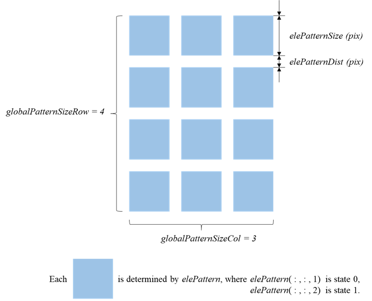
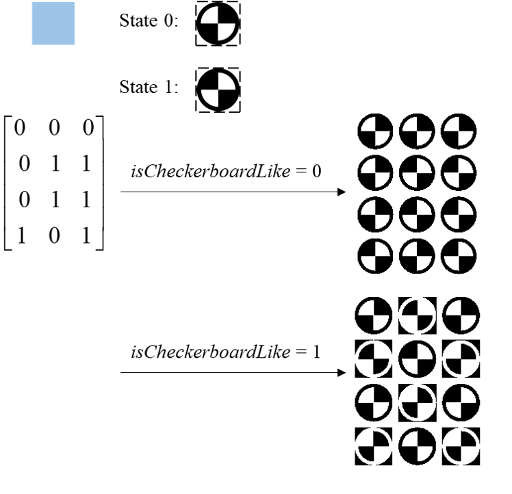
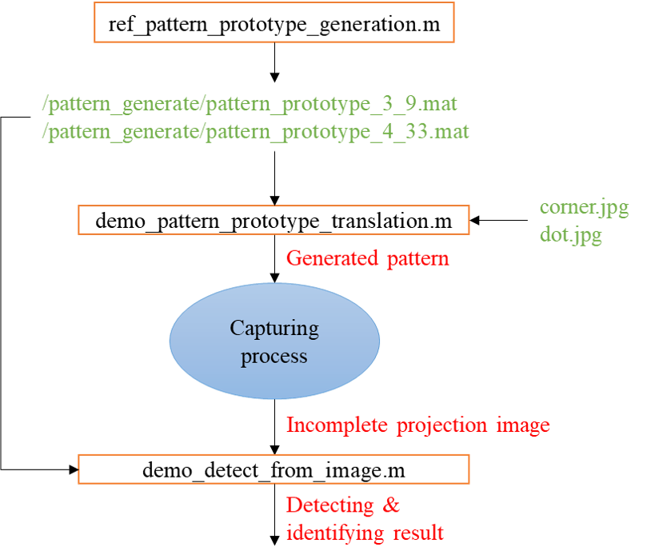

# A Novel Camera Calibration Pattern Robust to Incomplete Pattern Projection

# Introduction

This repo contain the source code used in the article "A Novel Camera Calibration Pattern Robust to Incomplete Pattern Projection". Also several readily generated calibration pattern are provided in this repo.

# How to use this repo?

## Generate pattern

### Step

1. Open demo_pattern_prototype_translation.m
2. Config 6 parammeters: *elePatternSize*, *elePatternDist*, *globalPatternSizeRow*, *globalPatternSizeCol*, *isCheckerboardLike*, and *elePattern*. 
3. Click "run" to get pattern image. 
4. Save the image and print it in to proper size.

### Params Definition

*isCheckerboardLike* determins whether reversing black and white nearby or not, as the figure below shows:

## Calibration image process

Please reference demo_detect_from_image.m for usage and effect.

# Files description

Relationships of several important files are shown in the figure below.

Description of each file :

| file/folder                                  | description                                                  |
| -------------------------------------------- | ------------------------------------------------------------ |
| ref_pattern_prototype_generation.m           | Codes for pattern prototype generation. Users are not necessarily to  execute this file since ready-to-use prototype has been already provided in  /pattern_generate. |
| demo_pattern_prototype_translation.m         | Run this file to translate the prototype into the pattern for use.  Definitions of configurations could be found in README.md. |
| demo_detect_from_image.m                     | This file shows the detecting and identifying process of an image with  incomplete pattern projection. |
| /pattern_generate                            | Source code of pattern generating process.                   |
| /detect                                      | Source code of pattern detecting process.                    |
| /data                                        | Images to be processed.                                      |
| /pattern_generate/pattern_prototype_3_9.mat  | Already generated pattern prototype for use. The minimun identifying size  is 3, and the pattern size should be no nore than 9. |
| /pattern_generate/pattern_prototype_4_33.mat | Already generated pattern prototype for use. The minimun identifying size  is 4, and the pattern size should be no nore than 33. |
| /pattern_generate/corner.png                 | Corner shape source file for each feature.                   |
| /pattern_generate/dot.png                    | Dot shape source file for each feature.                      |

# Important functions

- Func_GlobalNumPattern
- Func_LocalNumAtlas
- Func_PatternGeneration
- Func_VerifyGlobalNumPattern
- Func_DetectImage

# Contact us

email: gaozhang2018@ia.ac.cn